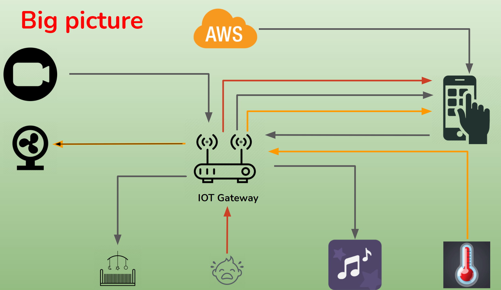
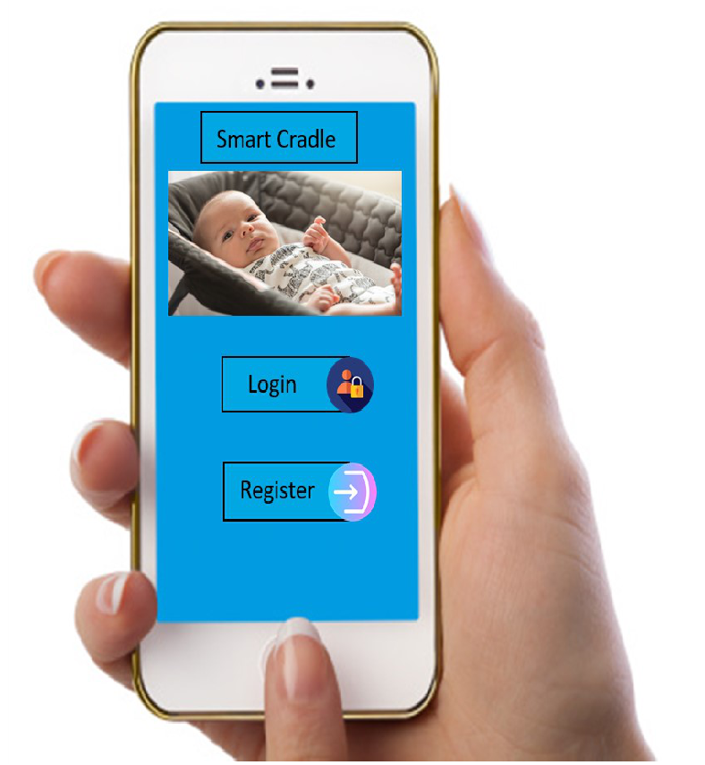
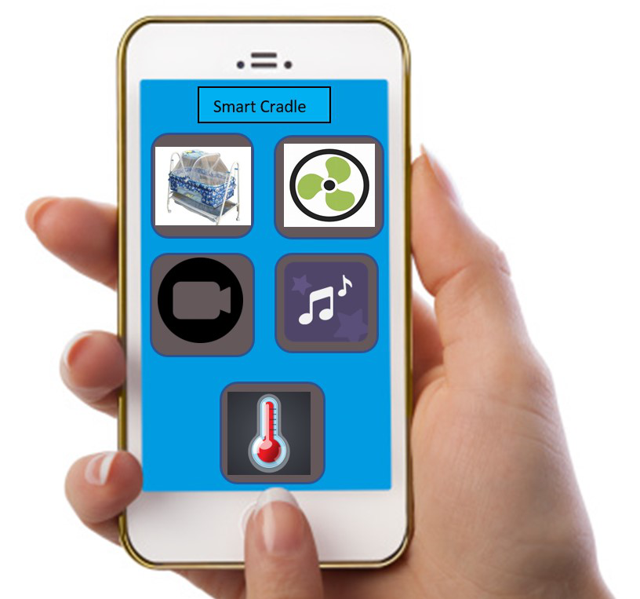

[comment]: # "This is the standard layout for the project, but you can clean this and use your own template"

# Smart Cradle 

---

## Team
-  E/17/040, Madush Chandrasena, [e17040@eng.pdn.ac.lk](e17040@eng.pdn.ac.lk)
-  E/17/356, Shashini Upekha, [e17356@eng.pdn.ac.lk](e17356@eng.pdn.ac.lk)
-  E/17/407, Hasara Wijesooriya, [e17407@eng.pdn.ac.lk](e17407@eng.pdn.ac.lk)

## Table of Contents
1. [Introduction](#introduction)
2. [Solution Architecture](#solution-architecture )
3. [Hardware & Software Designs](#hardware-and-software-designs)
4. [Testing](#testing)
5. [Detailed budget](#detailed-budget)
6. [Conclusion](#conclusion)
7. [Links](#links)

---

## Introduction

This is a sample image, to show how to add images to your page. To learn more options, please refer [this](https://projects.ce.pdn.ac.lk/docs/faq/how-to-add-an-image/)

Solutions
Smart Cradle System using IOT.

It helps to the parent to monitor their child even if they are away from home and detect every activity of the baby from any distant corner of the world.

Design a smart cradle with automatic swing(using cry detection),switch on fan automatically (using environment temperature)

Motivation
Decrease the gap between parent and baby

To keep an eye on the baby while working , in a secure and safe manner.

To balance professional life and their babies life 

## Solution Architecture

Big picture of the project:

## Hardware and Software Designs

Mobile Application :

Functions controlled by the mobile application:
*Monitor the baby 
*Check the room temperature 
*Switch on the fan
*Control the swing 
*Play some music 

Hardware Componets

    To swing the cradel:
	    Gear Motor
	    Motor driver
	    Power pack
    To monitor the baby:
	    Camara shield
    To detect cry:
	    Sound sensor
    To play music:
	    Mini speaker
    To measure temperature
	    Temperature Sensor
    Microcontroller:
	    NodeMCU
    Others:
	    Mini fan
	    wires etc

## Testing

Testing done on hardware and software, detailed + summarized results

## Detailed budget

All items and costs

| Item             | Quantity  | Unit Cost  | Total    |
| ---------------  |:---------:|:----------:|---------:|
|Gear Motor        | 1         | 1790 LKR   | 1790 LKR |
|Camera Shield     | 1         | 2950 LKR   | 2950 LKR |
|Sound Sensor      | 1         | 185 LKR    | 185 LKR  |
|Mini Speaker      | 1         | 1150 LKR   | 1150 LKR |
|Temperature sensor| 1         | 135 LKR    | 135 LKR  |
|Mini fan          | 1         | 600 LKR    | 600 LKR  |
|NodeMCU           | 1         | 1250 LKR   | 1250 LKR |
|Motor driver      | 1         | 850 LKR    | 850 LKR  |
|Power pack        | 1         | 700 LKR    | 700 LKR  |
|Other items       |           | 500 LKR    | 500 LKR  |
|                  |           |   Total    | 10110 LKR|

## Conclusion

Our future plans

    Add some more features:- 
	    A display to play videos 
	    A method to play different songs
	    Add a musical toy
	    A display such that both parent and baby can see each other

    Introduce our product to different market segments:-
	    Hospitals
	    Day care center

## Links

- [Project Repository](https://github.com/cepdnaclk/{{ page.repository-name }}){:target="_blank"}
- [Project Page](https://cepdnaclk.github.io/{{ page.repository-name}}){:target="_blank"}
- [Department of Computer Engineering](http://www.ce.pdn.ac.lk/)
- [University of Peradeniya](https://eng.pdn.ac.lk/)

[//]: # (Please refer this to learn more about Markdown syntax)
[//]: # (https://github.com/adam-p/markdown-here/wiki/Markdown-Cheatsheet)
